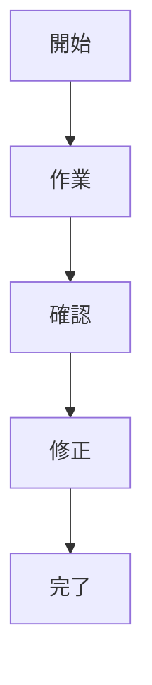

# 01 Customer Interview

顧客ヒアリングを、要件定義とプロトタイプ生成に直結させるための記録テンプレート。

## 1. 顧客プロフィール

- 会社名：
- 部署：
- 役職：
- 業務領域：
- 利用中ツール：
- 関係者：

## 2. 顧客の発言ログ

顧客の言葉をなるべくそのまま記録する。

```text
発言：
背景：
感情：困っている / 急いでいる / 諦めている / 試したい / 稟議したい
```

## 3. 表面的な要望

例：

- Revit操作を楽にしたい
- 図面チェックを自動化したい
- 議事録を整理したい
- 仕様書から必要情報を探したい

## 4. 本当の課題仮説

要望の裏側にある構造課題を推定する。

- 属人化
- 手戻り
- 判断基準の不統一
- 情報検索コスト
- 設計変更の伝達漏れ
- レビュー観点の不足
- 工程・コスト・品質の連動不足

## 5. 現行業務フロー



## 6. 詰まりポイント

| 工程 | 詰まり | 原因 | 影響 |
|---|---|---|---|
|  |  |  |  |

## 7. 顧客が本当に欲しい結果

- 時間削減：
- 品質向上：
- 判断支援：
- 標準化：
- 属人化解消：
- 売上/利益貢献：

## 8. 次回確認質問

- その作業は誰が、どの頻度で行っているか？
- 入力データは何か？PDF、Excel、Revit、IFC、画像、議事録、DB？
- 出力として何が欲しいか？画面、レポート、CSV、BIM操作、通知？
- 成功判定は何か？時間、精度、件数、手戻り削減？
- 現場で使えない条件は何か？
