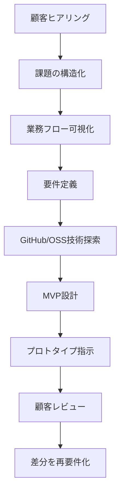

# PM Prototype OS v0.1

ArentでのエンジニアPM業務に向けた、顧客ニーズ把握・要件定義・プロトタイプ作成を超短時間化するためのPM補助OS。

## 目的

顧客ヒアリングから、課題整理・要件定義・MVP設計・技術探索・プロトタイプ指示までを一気通貫で行う。



## コア思想

- 顧客の発言をそのまま要件にしない
- 表面的な要望と根本課題を分ける
- MVPは「作れるもの」ではなく「検証できるもの」にする
- GitHubはコード置き場ではなく、技術知識データベースとして使う
- PMはプロトタイプを作る人ではなく、仮説検証速度を設計する人になる

## フォルダ構成

```text
pm-prototype-os/
  README.md
  01_customer_interview.md
  02_need_to_requirement.md
  03_mvp_scope.md
  04_prototype_prompt.md
  05_engineer_handoff.md
  06_arent_domain_questions.md
  07_github_research_targets.md
  cards/
    tech_card_template.md
    ifc_analysis.md
    bim_ai_agent.md
    construction_rag.md
```

## 標準出力

顧客打ち合わせ後、以下を即時生成する。

1. 顧客ニーズ
2. 本当の課題
3. 現行業務フロー
4. 理想業務フロー
5. 要件定義
6. MVP候補3案
7. 画面案
8. 技術候補
9. エンジニア確認事項
10. 次回顧客に聞く質問

## 初期ターゲット領域

- BIM / Revit / IFC
- 配筋・建設設計支援
- プラント設計支援
- 図面・仕様書・議事録RAG
- 建設業務のAI Agent化
- PM要件定義支援

## 使い方

1. 顧客議事録を `01_customer_interview.md` の型に入れる
2. `02_need_to_requirement.md` で発言を要件へ変換する
3. `03_mvp_scope.md` でMVPを切る
4. `04_prototype_prompt.md` をClaude / Codex / Cursorに渡す
5. `05_engineer_handoff.md` でエンジニアに渡す

## 最終目標

目標値を1つに決め切らず「30分」と「2時間」を別の用途で混在させていたのが旧版の問題だった。これを2段階のゴールとして明確化する。

### 30分ゴール（一次仮説・顧客との次回約束用）

60分の顧客打ち合わせ直後、30分以内に以下を出す。PM Brainに類似案件が蓄積されているほど、この30分の精度が上がる設計。

- 表面的な要望と真因候補（複数）
- 切り分け質問（次回聞くこと）
- MVPの方向性（3案の骨子レベル）
- 技術候補の当たり（カテゴリレベル）

### 2時間ゴール（実装着手用）

30分ゴールの内容をベースに、2時間以内に以下まで仕上げる。

- 要件定義
- MVP案（確定）
- 画面イメージ
- 技術候補（確定）
- エンジニア向け実装方針
- 次回顧客確認事項

30分で全部を確定させようとしないこと。30分は「次に何を確認すべきかが明確になっている」状態を指し、2時間で実装着手できる粒度に仕上げる。
