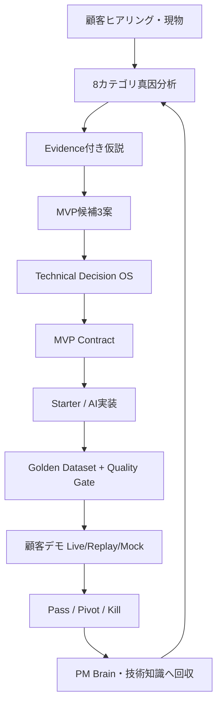

# PM Prototype OS v0.6

ArentでのエンジニアPM業務に向けた、**顧客発言→真因仮説→技術判断→MVP契約→実装→自動検証→学習回収**を高速化するPM補助OS。

## v0.6で変わったこと

従来は要件定義とMVP設計が中心だった。v0.6では、爆速開発と最高品質を両立させるため、2つの実行レイヤーを追加した。

1. **Technical Decision OS**
   - 条件付き技術選択
   - 相性・非互換
   - 既知の失敗
   - 比較実験
   - PoC→本番移行条件

2. **MVP Factory**
   - Executable MVP Contract
   - Golden Dataset
   - 自動品質ゲート
   - Live / Replay / Mockデモ
   - PoC結果の学習回収

## 全体フロー


```mermaid
flowchart TD
  A[顧客ヒアリング・現物] --> B[8カテゴリ真因分析]
  B --> C[Evidence付き仮説]
  C --> D[MVP候補3案]
  D --> E[Technical Decision OS]
  E --> F[MVP Contract]
  F --> G[Starter / AI実装]
  G --> H[Golden Dataset + Quality Gate]
  H --> I[顧客デモ Live/Replay/Mock]
  I --> J[Pass / Pivot / Kill]
  J --> K[PM Brain・技術知識へ回収]
  K --> B
```

## コア思想

- 顧客の発言をそのまま要件にしない
- 現物 > 顧客原文 > 業務フロー > 社内メモ > AI要約
- 表面的な要望と真因を分ける
- MVPは最小機能ではなく最小検証単位
- 技術名を集めず、条件→判断→理由→切替条件を保存する
- 成功例より失敗症状・非採用条件を先に検索する
- AI抽出・生成の後段に決定論的検証を置く
- デモはLiveだけに依存せずReplay/Mockを持つ
- PM最終判断はAIに書かせない
- 案件を重ねるほど、質問・技術判断・テストが増える構造にする

## 30分 / 2時間 / MVP完成の3段階

### 30分：一次仮説

- 表面的な要望と真因候補
- Evidenceの強弱
- 次回確認質問
- MVP方向性3案
- 技術カテゴリの当たり

### 2時間：実装着手可能

- 推奨MVP
- 入力・処理・出力
- 画面・業務フロー
- Technical Decision候補
- MVP Contract初版
- Golden Case候補
- 実装指示

### MVP完成：顧客提示可能

- Contract必須項目が埋まっている
- Technical Decision IDが存在する
- Golden Datasetを通している
- 必須Quality Gateが成功している
- ReplayまたはMockがある
- Pass / Pivot / Kill条件がある

## ディレクトリ

```text
pm-prototype-os/
  00_data_policy.md
  01_customer_interview.md
  02_need_to_requirement.md
  03_mvp_scope.md
  04_prototype_prompt.md
  05_engineer_handoff.md
  06_arent_domain_questions.md
  07_github_research_targets.md
  08_ai_tool_routing.md
  master_prompt.md

  root_cause_engine/        # 真因分析・Evidence・VDR
  technical_decision_os/    # 技術判断・相性・失敗・移行知識
  mvp_factory/              # Contract・Golden Dataset・品質ゲート
  starters/                 # 動くMVPスターター
  cards/                    # 人間向けTech Card
  pm_brain/                 # 案件横断の判断メモリ
  orchestration/            # 自動実行
  library/                  # 評価・デモ・OSS台帳
  domain/                   # 建設DX固有知識
```

## 最短クイックスタート

### 1. 真因を切る

`01_customer_interview.md`と`root_cause_engine/`で、Data / Process / Tool / People / Rule / Organization / Contract / Costへ分解する。

### 2. MVPを決める

`03_mvp_scope.md`でDemo / Data / Workflow MVPを比較し、推奨案を1つ選ぶ。

### 3. 技術判断を検索する

```bash
python3 technical_decision_os/scripts/search_knowledge.py --keyword "対象技術"
python3 technical_decision_os/scripts/search_knowledge.py --kind failure --domain "対象領域"
```

### 4. MVP Contractを作る

```bash
cp mvp_factory/contracts/_template.json path/to/mvp_contract.json
```

### 5. StarterまたはAIで実装する

既存Starterを0→60の開始地点として使い、`04_prototype_prompt.md`と`05_engineer_handoff.md`へContractとDecision IDを渡す。

### 6. 品質ゲート

```bash
python3 technical_decision_os/scripts/validate_knowledge.py
python3 mvp_factory/scripts/verify_mvp.py \
  --contract path/to/mvp_contract.json \
  --project-root path/to/project
```

### 7. 学習を戻す

PoC結果を`pm_brain/cases/`へ記録し、効いた知見はEvidenceを昇格、失敗はFailure Cardへ追加する。

## 情報の保存先

| 情報 | 保存先 |
|---|---|
| 顧客の生データ・図面・契約 | Google Drive等の一次情報置き場 |
| 案件の要約・仮説・PoC結果 | `pm_brain/cases/` |
| 人間が読む技術概要 | `cards/` |
| 機械検索する技術判断 | `technical_decision_os/knowledge/` |
| MVP完成条件 | 案件の`mvp_contract.json` |
| 正解ケース | 案件のGolden Dataset |
| 自動検証結果 | `*.quality-report.json` |

## 重要な境界

- Tech CardとTechnical Decision JSONは役割が違う
  - Card：理解・説明
  - JSON：検索・検証・参照
- PoC構成と本番構成を同一視しない
- E0/E1の知識を標準採用しない
- L3データをクラウドAIへ無条件に渡さない
- Quality Gate失敗を説明だけで握りつぶさない
- 成功したコードだけでなく、失敗条件とテストを資産化する
