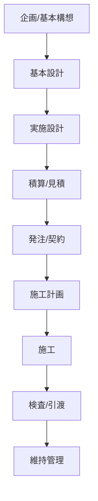

# Construction Domain Map

建設業特有の業務・情報・制約をPM Prototype OSで扱うための全体地図。

## 建設業の大きな特徴

建設業は、一般的なSaaSや製造業と違い、次の制約が強い。

- 案件ごとに一品生産
- 多層下請構造
- 発注者・設計者・施工者・協力会社の利害が分かれる
- 図面・仕様書・見積・工程・写真・検査記録が大量に発生する
- 現場と本社で情報の粒度が違う
- 変更・手戻り・追加工事が発生しやすい
- 安全・品質・工程・原価が常にトレードオフになる
- 法令・契約・出来形・検査などの証跡が重要

## 建設プロジェクトの基本フェーズ

## フェーズ別のPM着眼点

| フェーズ | 主な情報 | よくある課題 | AI/OS化テーマ |
|---|---|---|---|
| 企画 | 要望、予算、敷地、既存資料 | 要件が曖昧 | ヒアリング整理、要求定義 |
| 基本設計 | BIM、図面、設計条件 | 意思決定の遅れ | 比較案、合意形成支援 |
| 実施設計 | 詳細図、仕様書、計算書 | 整合不備、手戻り | 図面・仕様書チェック |
| 積算 | 数量、単価、BOQ、見積 | 拾い漏れ、単価差 | 数量抽出、差分分析 |
| 発注 | 見積比較、契約、協力会社 | 条件違い、責任範囲不明 | 見積比較、契約条件抽出 |
| 施工計画 | 工程表、施工図、仮設、安全 | 段取り不足 | 工程・リスク抽出 |
| 施工 | 日報、写真、検査、変更 | 情報散乱、遅延 | 現場RAG、写真整理 |
| 検査 | 出来形、品質、安全書類 | 証跡不足 | 検査記録チェック |
| 維持管理 | 竣工図、BIM、点検記録 | 情報が引き継がれない | FM/BIMナレッジ化 |

## 建設業の情報オブジェクト

| オブジェクト | 内容 | PM要件化の観点 |
|---|---|---|
| 図面 | 平面図、断面図、詳細図、施工図 | 版管理、差分、参照関係 |
| BIM | 3Dモデル、属性、数量、関係性 | IFC、Revit、属性品質 |
| 仕様書 | 材料、性能、施工条件 | 条件抽出、図面との整合 |
| 見積 | 数量、単価、金額、条件 | 比較、漏れ、根拠 |
| 工程表 | タスク、期間、依存関係 | 遅延要因、クリティカルパス |
| 日報 | 作業内容、人員、機械、天候 | 実績把握、進捗差分 |
| 写真 | 施工前後、検査、是正 | 撮影箇所、証跡、分類 |
| 議事録 | 決定、未決、宿題、変更 | 意思決定ログ、責任分界 |
| 検査記録 | 品質、安全、出来形 | 合否、是正、証跡 |
| 契約 | 請負範囲、支払、変更条件 | リスク、責任、追加工事 |

## PMが見るべき建設業の4大ズレ

### 1. 図面と仕様書のズレ

図面に書いてある内容と、仕様書の条件が一致しない。

### 2. 契約範囲と現場認識のズレ

契約上は含まれない作業を、現場では当然と思っている。

### 3. 工程計画と実績のズレ

計画工程と、日報・写真・実績が一致しない。

### 4. BIMモデルと現場実態のズレ

モデル上の情報と、施工済み状態・点検状態が一致しない。

## 要件定義で重要な質問

- どのフェーズの課題か？
- 誰の業務時間を減らすのか？
- 入力データは何か？
- 出力は誰が使うのか？
- 正解判定は誰がするのか？
- AIは自動実行か、候補提示か？
- 証跡として残す必要があるか？
- 現場で使えるUIか？
- 本社側の管理指標とつながるか？

## Arent親和性の高い領域

- BIM/Revit操作支援
- IFC属性チェック
- 図面・仕様書RAG
- 配筋・設計ルール支援
- プラント設計ルール確認
- 点群からBIM/IFC化
- 設計変更・議事録・図面差分管理
- 施工/設計レビューのAI Agent化
