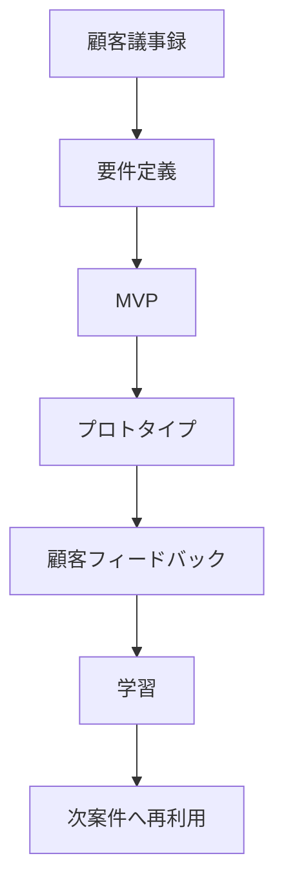

# PM Brain

PM Prototype OSを案件ごとに賢くするための記録領域。

## 実装（v0.2で追加）

旧版はテンプレートのみで、実際に保存されたケースが0件だった。v0.2で最小実装を追加した。

```text
pm_brain/
  README.md
  cases/
    _template.md          ← 新規ケース作成時にコピーする
    case_001_demo_drawing_search.md  ← 動作確認用の最初の1件（デモ）
  scripts/
    search_cases.py        ← 検索スクリプト（外部ライブラリ不要）
```

### 新しい案件を追加する

1. `cases/_template.md` を `cases/case_XXX_顧客名や案件名.md` としてコピー
2. frontmatter（`industry` / `phase` / `cause_category` / `tech_category` / `status` / `poc_result`）を埋める
3. 本文の各セクションを埋める

### 検索する

```bash
cd pm_brain/scripts
python3 search_cases.py                          # 全件一覧
python3 search_cases.py --industry 建築            # 業界で絞り込み
python3 search_cases.py --cause Data               # 真因カテゴリで絞り込み
python3 search_cases.py --keyword 版管理            # キーワード検索
python3 search_cases.py --industry 建築 --cause Data -v   # 複合条件＋学びの抜粋表示
```

ベクトルDBや埋め込み検索は意図的に使っていない。案件数が数十件を超えてから検討すれば十分で、最初の数年はfrontmatterベースの構造化検索で十分機能する（過剰実装を避ける、というOS自体の思想に合わせている）。設計判断の詳細な根拠は `pm_brain/architecture_reference.md` を参照。

### 運用ルール

- 過去の資料を遡及的に大量投入しない。今動いている案件・直近の案件から追加していく（インプットの質を保つため）。
- PoC評価（`library/poc_evaluation.md`）でGo/No-Go判定が出たら、そのままその案件の `成功/失敗` と `次案件に使える学び` を更新する。これを次の打ち合わせ前に必ず1回検索してから臨む。

## 目的（変更なし）

顧客ヒアリング、要件定義、プロトタイプ、顧客フィードバック、失敗・成功パターンを蓄積し、次案件で再利用する。



## 保存するもの

- 顧客発言
- 表面的な要望
- 本当の課題
- 業務フロー
- 要件定義
- MVP案
- 採用した技術
- 作ったプロトタイプ
- 顧客反応
- 成功理由
- 失敗理由
- 次回使える型

## 案件記録テンプレート

```text
# Project Memory

## 顧客

## 業界/領域

## フェーズ
設計 / 積算 / 施工 / 検査 / 維持管理

## 顧客発言

## 表面的な要望

## 本当の課題

## 業務フロー

## 要件

## MVP

## 技術候補

## 採用技術

## プロトタイプ

## 顧客フィードバック

## 成功/失敗

## 次案件に使える学び
```

## 類似案件検索の軸

- 業界
- フェーズ
- データ種類
- 顧客課題
- 技術カテゴリ
- MVPパターン
- 失敗パターン
- 成功条件

## PM Brainの最終形

顧客が話した瞬間に、過去案件・技術カード・UIパターン・質問集から次の仮説を出せる状態。

```text
この課題は過去の〇〇案件に近い
使えそうな技術は〇〇
MVPは〇〇パターン
次に聞くべき質問は〇〇
失敗リスクは〇〇
```
