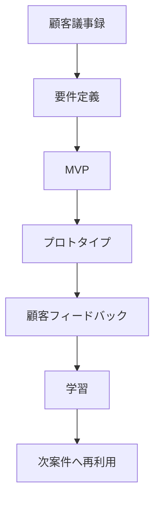

# PM Brain

PM Prototype OSを案件ごとに賢くするための記録領域。

## 目的

顧客ヒアリング、要件定義、プロトタイプ、顧客フィードバック、失敗・成功パターンを蓄積し、次案件で再利用する。



## 保存するもの

- 顧客発言
- 表面的な要望
- 本当の課題
- 業務フロー
- 要件定義
- MVP案
- 採用した技術
- 作ったプロトタイプ
- 顧客反応
- 成功理由
- 失敗理由
- 次回使える型

## 案件記録テンプレート

```text
# Project Memory

## 顧客

## 業界/領域

## フェーズ
設計 / 積算 / 施工 / 検査 / 維持管理

## 顧客発言

## 表面的な要望

## 本当の課題

## 業務フロー

## 要件

## MVP

## 技術候補

## 採用技術

## プロトタイプ

## 顧客フィードバック

## 成功/失敗

## 次案件に使える学び
```

## 類似案件検索の軸

- 業界
- フェーズ
- データ種類
- 顧客課題
- 技術カテゴリ
- MVPパターン
- 失敗パターン
- 成功条件

## PM Brainの最終形

顧客が話した瞬間に、過去案件・技術カード・UIパターン・質問集から次の仮説を出せる状態。

```text
この課題は過去の〇〇案件に近い
使えそうな技術は〇〇
MVPは〇〇パターン
次に聞くべき質問は〇〇
失敗リスクは〇〇
```
