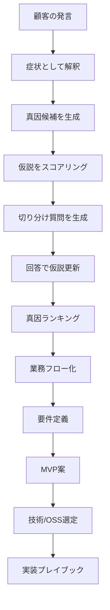

# Root Cause Engine

顧客の要望をそのまま機能化せず、真因・要件・MVP・実装案まで変換するPM推論エンジン。

## 目的

顧客の発言から、表面的な要望と本当の課題を分離し、深掘り質問・真因仮説・要件定義・MVP・実装方針まで一気通貫で出す。



## 採用する考え方

- 5 Whys: なぜを重ねて原因を掘る
- Fishbone: 人・プロセス・データ・ツール・組織など複数要因に分解する
- Issue Tree: 問題を分解して、原因と解決策を分ける
- A3: 問題、現状、目標、原因、対策、検証を1枚にまとめる
- 8D: 暫定対応、根本原因、恒久対応、再発防止まで扱う

## 重要方針

5 Whysだけに頼らない。

理由：

- 1本の原因に寄せすぎる
- 分析者の知識範囲を超えにくい
- 建設業のような複雑業務では複数原因が絡む
- 顧客の発言が症状なのか原因なのか混ざる

このOSでは以下を基本にする。

```text
単一真因ではなく、複数真因候補を出す
↓
質問で切り分ける
↓
確度を更新する
↓
最小MVPで検証する
```

## 入力

- 顧客議事録
- 顧客の発言
- 現行業務フロー
- 困っている作業
- 利用中ツール
- 入力データ
- 出力物
- ステークホルダー

## 出力

1. 顧客要望
2. 症状としての解釈
3. 真因候補
4. 真因スコア
5. 深掘り質問
6. 切り分けロジック
7. 業務フロー
8. 要件定義
9. MVP候補
10. 技術構成
11. 実装プレイブック
12. PoC評価基準

## PMの使い方

顧客が何かを要望したら、すぐ作らない。

まず以下を確認する。

```text
それは本当に欲しい機能か？
それとも困りごとの症状か？
その裏にある業務構造は何か？
誰のどの判断が詰まっているのか？
AIで解くべきか、業務整理で解くべきか？
```

## 建設業向け真因カテゴリ

| カテゴリ | 例 |
|---|---|
| Data | 図面版、BIM属性、PDF品質、台帳不備 |
| Process | 承認フロー、変更管理、検査手順 |
| Tool | Revit、Excel、PDF、施工管理アプリ |
| People | 熟練者依存、若手教育、協力会社連携 |
| Contract | 契約範囲、追加工事、責任分界 |
| Quality | 検査基準、証跡、是正管理 |
| Schedule | 工程遅延、依存関係、段取り |
| Cost | 見積条件、数量拾い、単価差 |
| Governance | ルール未整備、版管理、監査性 |

## 最終ゴール

顧客の一言から、PMが以下を数分で出せる状態にする。

```text
この要望の真因候補はA/B/C
切り分け質問はこれ
最初のMVPはこれ
実装はこのパターン
リスクはこれ
次回顧客確認はこれ
```
