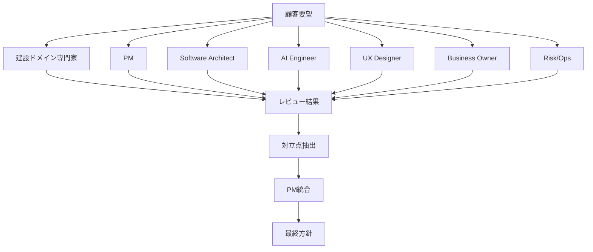

# Virtual Design Review

顧客要望・要件・MVP案を、複数の専門家視点でレビューし、PMが最終統合するためのモジュール。

## 目的

1人PMでも、脳内に複数の専門家を置いて設計レビューできる状態を作る。



## 使うタイミング

- 顧客要望を受け取った直後
- Root Cause Engineで真因候補を出した後
- MVP案を決める前
- 技術選定前
- 顧客提案前
- エンジニアへ実装依頼する前

## レビュー対象

- 顧客要望
- 真因仮説
- 業務フロー
- 要件定義
- MVP案
- UI案
- 技術構成
- PoC評価基準

## 基本フロー

```text
1. 顧客情報を入力
2. 各専門家ロールでレビュー
3. 反対意見・懸念・追加質問を出す
4. 対立点を整理
5. PMが統合
6. 推奨MVPと実装方針を決定
```

## 最終出力

- 真因候補ランキング
- 最初に聞くべき質問
- 推奨MVP
- 採用しないMVP
- 技術構成
- UI方針
- PoC成功条件
- 実装リスク
- Claude Code / Codex向け実装指示
